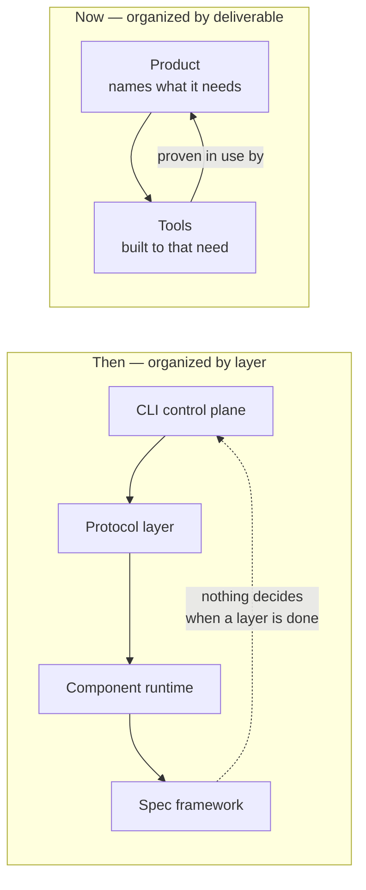
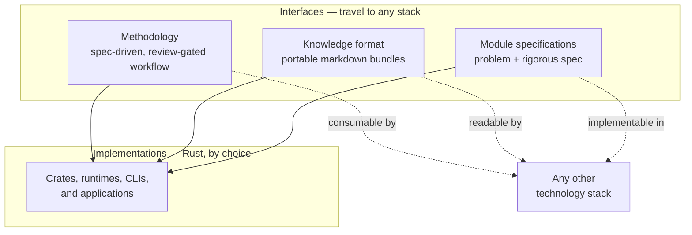
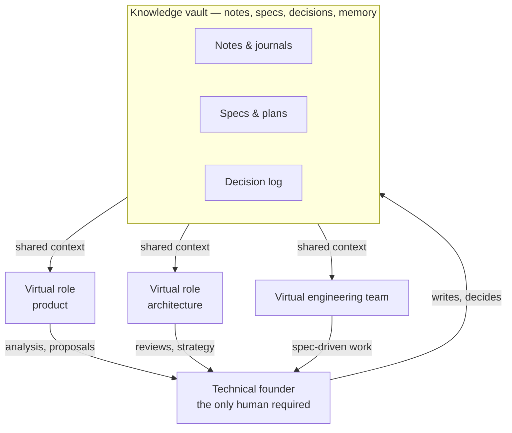

# 🦀 AirsStack

# airsstack

**Open-source AI and Rust engineering, organized around products that ship.**

airsstack builds three kinds of thing, and nothing else:

| Category | What it means |
| --- | --- |
| **End-user products** | Applications a person installs and uses. |
| **Engineering tools** | Libraries, runtimes, CLIs, and plugins that other developers build with. |
| **Community & ecosystem** | Open specifications and shared artifacts that belong to no single implementation. |

Every repository here answers to one of those three, and every repository names the artifact it ships — a binary, an installable plugin, an application. That constraint is deliberate, and it comes from experience.

---

## How this organization got here

The first version of airsstack was a single monorepo organized by architectural layer: a WebAssembly component runtime, a protocol layer of MCP servers, a specification framework, and a CLI positioned as a control plane over all of it. Each layer was coherent. None of them had a user.

The defect was structural rather than technical. Organizing by layer means nothing above the layers decides when a layer is finished, so every component expands to fill the attention available and the work never terminates. Infrastructure was being perfected ahead of any demand that would have constrained it.

The current organization inverts the arrow. A product states what it needs; the tools are built to that need and proven by it. A library whose only justification is that another airsstack repository might want it one day does not get built. This is why the roadmap below is short — it lists what has a consumer today, not everything that would be interesting to make.

The earlier work is not deleted. The Claude SDK and the plugin suite carry their full commit history into `claudestacks`; everything that survived the move survived because something needed it.

---

## AI and Rust are the foundation, not the requirement

The name says what airsstack builds *with*: AI-assisted engineering as the method, Rust as the implementation core. It does not say what you must build with in order to use the results.

The distinction is between implementations and interfaces. Implementations here are opinionated and written in Rust — a house choice, made for performance, single-binary distribution, and a strict definition of done. Interfaces are the artifacts designed to travel: specifications, formats, and methodology carry no language requirement at all.

This is already the case rather than an intention. The methodology plugin suite is language-agnostic by construction: the execution agents take their rules and Definition of Done from whichever guideline skill is installed and degrade gracefully when none is present, so the Rust guidelines are one interchangeable member rather than the premise. A vault written by AirsVault is Open Knowledge Format markdown, readable by any tool in any language that can parse a file.

OpenMod is the fullest expression of the same idea — a module is a problem plus a rigorous specification, held deliberately apart from any single implementation so the same module can be built in Rust and in whatever else a project calls for.

The boundary is stated plainly because it is what keeps the claim honest: specifications, formats, and methodology are meant to be portable. Implementations are not promised in every language, and a request to port one is not automatically in scope.

---

## Repositories

```mermaid
%% airsstack organization map
graph TD
    ROOT["airsstack"]

    ROOT --> PROD["End-user products"]
    ROOT --> TOOLS["Engineering tools"]
    ROOT --> ECO["Community & ecosystem"]

    PROD --> AV["airsvault<br/>local-first AI workspace"]

    TOOLS --> CS["claudestacks<br/>Claude SDK, plugin lifecycle engine,<br/>methodology plugin suite"]
    TOOLS --> AL["airsl<br/>sandboxed Lua runtime for Rust"]
    TOOLS --> OR["openrouter-rs<br/>OpenRouter SDK — planned"]
    TOOLS --> OKF["okf-rs<br/>Open Knowledge Format tooling — planned"]

    ECO --> OM["OpenMod<br/>runnable module specifications — exploring"]

    style ROOT fill:#2e4636,stroke:#7fb589
    style PROD fill:#3a2e4a,stroke:#9b7fc9
    style TOOLS fill:#4a3f2a,stroke:#c9a35c
    style ECO fill:#4a2e2e,stroke:#c96b6b
```

### [`airsl`](https://github.com/airsstack/airsl) — *published*

An embeddable Lua 5.4 runtime for Rust in which the **host** decides what a script may reach. Lua is statically linked, a sandbox policy is required at construction rather than offered as an option, and every capability a script has arrives as a host module under a single global. A script gets JSON, filesystem access, subprocesses, and regular expressions only to the extent the embedding program granted them — authority lives in the grant, not in whether a table happens to exist.

Ships `airsl` (the library) and `airsl-cli` (the binary). Linux and macOS today; Windows support is planned, and is a real design question about what "executable" means there rather than a portability patch.

### [`claudestacks`](https://github.com/airsstack/claudestacks) — *usable*

The Claude Code half of the stack, in three parts:

- **`clauders`** — a Rust SDK for Claude, built toward full feature and behavioral parity with Anthropic's official SDKs across the Messages API, the Agent SDK, and Managed Agents. A Rust caller should get what a Python or TypeScript caller gets.
- **`claudevs`** — a deterministic test harness for Claude Code plugins [1], spawning a plugin's hooks the way the runtime would. It fills the gap between manifest validation and non-deterministic evaluation.
- **A five-plugin marketplace** packaging a spec-driven, review-gated development methodology: a TDD coder, a merged code-and-spec reviewer, a read-only explorer, an orchestration driver, the `brainstorm → write-plan → execute-plan` workflow, Rust engineering guidelines with a strict Definition of Done, and an Obsidian-compatible [2] experiential journal with embedding-free deterministic recall.

Every plugin hook runs on the `airsl` binary — the tools prove each other.

### [`airsvault`](https://github.com/airsstack/airsvault) — *in development*

> *A super-note-taking app for technical founders and solo builders.*

An AI-native workspace whose premise is that **notes are the substrate of a company**. AirsVault is a company runtime for a team of one: a workspace where a founder's notes, specifications, decisions, and agent memory form a single coherent knowledge vault in plain, portable markdown, from which an entire virtual organization operates.

Written in Rust on GPUI [3], the UI framework from the Zed editor. Three commitments define it:

1. **Local-first by architecture.** Files are the source of truth; indexes are derived and disposable. Knowledge is never trapped in a proprietary database or a vendor relationship.
2. **A virtual team, not chat personas.** Persistent, user-definable AI roles share the vault as context, keep structured memory across months, and operate under bounded authority — agents analyze, prepare, and flag; **the founder decides**. Each role is itself a document in the vault: versioned, inspectable, shareable.
3. **Built on the tools beside it.** AirsVault uses `clauders` and the airsstack methodology directly. The founder is the first user of the virtual team.

The vault conforms to the **Open Knowledge Format** [4][5], the vendor-neutral specification published by Google Cloud that formalizes the LLM-wiki pattern of interlinked, agent-readable markdown. Adopting an industry standard rather than a house format keeps every vault interoperable with the wider OKF ecosystem.

---

## Planned

Two repositories are planned, each because something already needs it.

**`openrouter-rs`** — a Rust SDK for OpenRouter [6], giving cost-flexible access to models behind one interface. It has an existing consumer and moves into the organization as a standalone workspace.

**`okf-rs`** — a Rust implementation of the Open Knowledge Format: `okf` as the library for reading, writing, traversing, and validating bundles, and `okf-cli` as the public binary. AirsVault needs the library regardless of whether anyone installs the CLI, which is what makes it worth building. Scope follows the specification's own boundaries — OKF is not a runtime, not a search index, and not a service, so neither is this.

## Exploring

Ideas with a design but no committed timeline. They appear here so the reasoning is public, not because they are scheduled.

**`buildl`** — a build system built on `airsl`, applying capability-granted sandboxing to build scripts so that hermeticity comes from explicit grants rather than from containers. AirsVault would be the first consumer, developed in parallel and adopted only once it is ready.

**OpenMod** — an open catalog of runnable modules, where a module is a described problem plus a rigorous, implementation-agnostic specification that can be composed with others and implemented in more than one technology stack. Rigorous specifications are precisely the artifact AI coding agents need as input. Nothing is published yet.

---

## Principles

1. **Every repository names its user and its artifact.** A binary, an installable plugin, an application. "A library other airsstack repositories might use" is not an answer.
2. **The product proves the tools.** Layers are built because something above them needs them, and are finished when that need is met.
3. **Spec-first.** Specifications are the primary artifact — in the methodology plugins, in OpenMod, and in how agents operate. Nothing is decided by conversation alone.
4. **Local-first, open standard.** Knowledge lives in plain, portable files conforming to open specifications. Files are the source of truth; there is no lock-in.
5. **Scope is a decision, not a default.** Additions must earn their place. The absence of a thing from this page is usually deliberate.

Everything is open source under Apache-2.0, with DCO sign-off on contributions.

---

## References

1. Anthropic. *Claude Code.* URL: <https://www.claude.com/product/claude-code>
2. Obsidian. *Obsidian — sharpen your thinking.* URL: <https://obsidian.md/>
3. Zed Industries. *GPUI — a GPU-accelerated UI framework for Rust.* URL: <https://www.gpui.rs/>
4. Google Cloud. *How the Open Knowledge Format can improve data sharing.* Google Cloud Blog, June 2026. URL: <https://cloud.google.com/blog/products/data-analytics/how-the-open-knowledge-format-can-improve-data-sharing>
5. Google Cloud Platform. *Open Knowledge Format specification.* GitHub. URL: <https://github.com/GoogleCloudPlatform/knowledge-catalog/blob/main/okf/SPEC.md>
6. OpenRouter. *A unified interface for LLMs.* URL: <https://openrouter.ai/>
